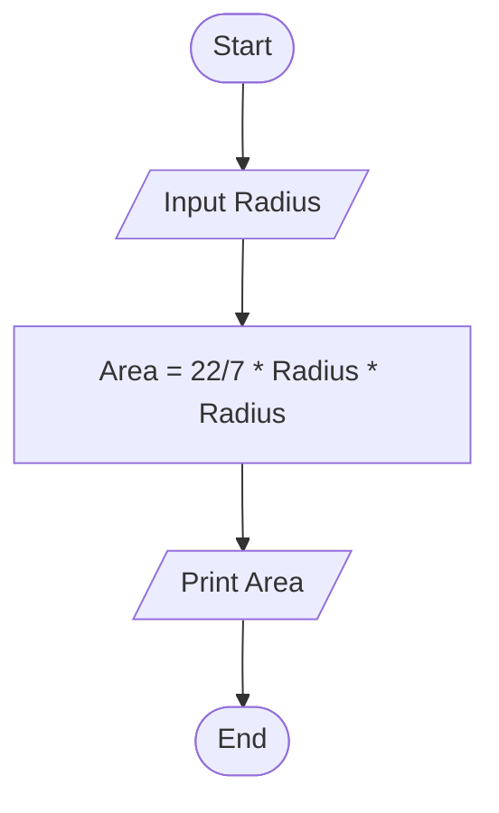

// Flowchart to calculate the area of a circle.

```mermaid
flowchart TD
    A([Start]) --> B[/Input Radius/]
    B --> C[Area = 22/7 * Radius * Radius]
    C --> D[/Print Area/]
    D --> E([End])
```