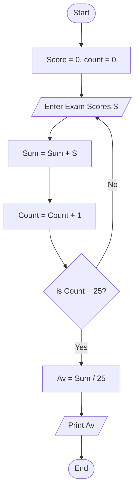

// Flowchart for calculating the average from 25 exams cores.

```mermaid
flowchart TD
    A([Start]) --> B[Score = 0, count = 0]
    B --> C[/Enter Exam Scores,S/]
    C --> D[Sum = Sum + S]
    D --> E[Count = Count + 1]
    E --> F{is Count = 25?}
    F -- No --> C
    F -- Yes --> G[Av = Sum / 25]
    G --> H[/Print Av/]
    H --> I([End])
```